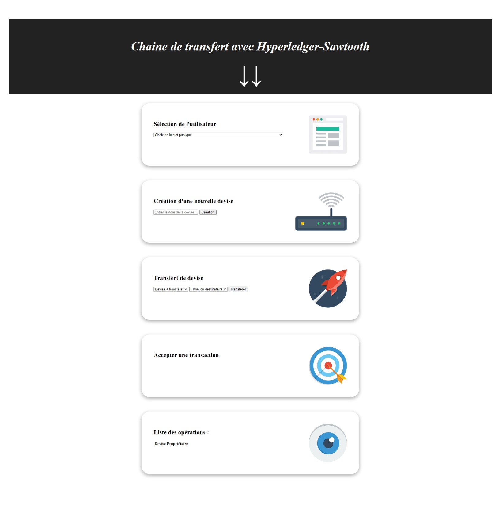

# BlockChain Project : Hyperledger-Sawtooth

Ce projet a pour but de simuler une supply-chain sur la blockchain afin de suivre les transactions de monnaies créées en amont ! 


<div style="text-align:center"><em>Screenshot du client</em></div>
 <br>

## Installation

Ce projet nécessite à la fois [Docker](https://www.docker.com/) et
[Node/NPM](https://nodejs.org/). Après l'installation, téléchargez ce dépôt et exécutez les commandes suivantes pour installer les dépendances pour le processeur de transaction :

```bash
cd {project directory}/processor
npm install
```

Et ces commandes pour installer les dépendances et build le client :

```bash
cd {project directory}/client
npm install
npm run build
```

## Running

### **Composants Sawtooth**

Utilisez le fichier docker compose inclus pour lancer certains composants par défaut de Sawtooth, notamment un validateur et une API REST. Des instructions complètes sont disponibles dans le
[Sawtooth Documentation](https://sawtooth.hyperledger.org/docs/core/releases/0.8/app_developers_guide/docker.html),
mais tout ce que vous devez savoir, c'est qu'à partir du répertoire du projet, il faut exécuter la commande suivante pour démarrer Sawtooth :

```bash
docker-compose up
```

Ensuite lancez cette commande pour le shutdown :

```bash
docker-compose down
```

Une fois lancé, vous devriez pouvoir accéder au validateur à l'adresse suivante
`tcp://localhost:4004` et à l'API REST à `http://localhost:8008`.

### _Transaction Processor_

Dans une nouvelle fenêtre de terminal, démarrez le processeur de transaction :

```bash
cd {project directory}/processor
npm start
```

### _Browser Client_

Démarrez le client en ouvrant simplement `client/index.html` dans n'importe quel navigateur.

## Usage

### C*réation d'un utilisateur*

Les utilisateurs sont simplement des paires de clés publiques/privées stockées dans localStorage. Créez-en un à partir la liste déroulante _"Select User"_. Vous pouvez utiliser ce même menu déroulant pour basculer entre plusieurs utilisateurs depuis localStorage.

### _Création d'une devise_

Il suffit de taper le nom de votre actif sous _"Create Asset"_ et de cliquer sur le bouton de création. Si vous avez sélectionné un utilisateur, vous devriez voir cette ressource apparaître dans la liste en bas.

### _Transfert d'une devise_

Tout actif que vous possédez peut être transféré vers une autre clé publique en utilisant les listes déroulantes sous _"Transfer Asset"_. Notez que le transfert doit être accepté par cet utilisateur avant qu'il ne soit finalisé.

### _Acceptation ou refus d'une transaction_

Tous les transferts en attente pour l'utilisateur sélectionné apparaîtront sous la rubrique _"Accept Asset"_.
Ils peuvent être acceptés (avec un changement immédiat de propriétaire) ou rejetés à l'aide des boutons correspondants.
